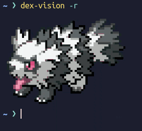
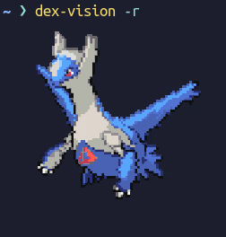
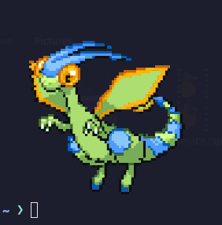
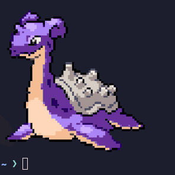

# DexVision

A script to print out animated sprites of pokemon to the terminal. Inspired by
[Pokemon Color Scripts](https://gitlab.com/phoneybadger/pokemon-colorscripts)


Gen 1 to 5 original sprites are from EBDX

For the next generations original sprites are from pokemon Showdown.

Not all the sprites available in Pokemon Showdown are in this program because some of them appear bugged in the terminal.

5% chance of shiny in random

## Visuals




### Startup




## Requeriments
The program requires `python3`,`pip`,`pyinstaller`
```
sudo apt install python3-pip
```
```
pip install -U pyinstaller
```
## Installation

```
git clone https://github.com/PauBotella/DexVision.git
```
```
cd DexVision
./install.sh
```
Make sure that the folder `~/.local/bin` is in PATH.
```
echo $PATH
```
#### If not:
#### In bash
```
export PATH="$PATH:~/.local/bin"
source ~/.profile
source ~/.bashrc
```
#### In fish
```
set -U fish_user_paths ~/.local/bin $fish_user_paths
```
## Uninstallation
Go to the proyect folder and:
```
./uninstall.sh
```

## Usage
```
usage: DexVision [-h] [-s] [-n NAME] [-l] [-r]

Show pokemon animated sprites

options:
  -h, --help            show this help message and exit
  -s, --shiny           Displays the pokemon in its shiny form. Only with -p flag
  -n NAME, --name NAME  Select pokemon by name, for see the available pokemon use -l flag with
                        grep to filter that you want
  -l, --list            Displays a list of available pokemon
  -r, --random          Displays a pokemon randomly
```
### Examples
Display a specific pokemon
```
dex-vision -n yanmega
```
Display a specific pokemon shiny
```
dex-vision -n yanmega -s
```
Display a random pokemon (5% chance of shiny)
```
dex-vision -r
```
Display a list with all available pokemons
```
dex-vision -l
```
#### Filter the list
Search pokemon that contains cha in the name
```
dex-vision -l | grep cha
```
Search pokemon in gigamax form
```
dex-vision -l | grep gmax
```
